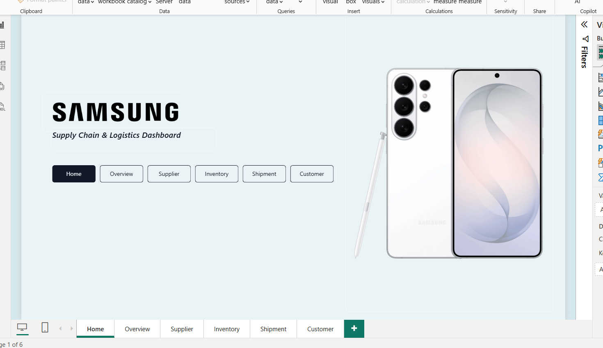
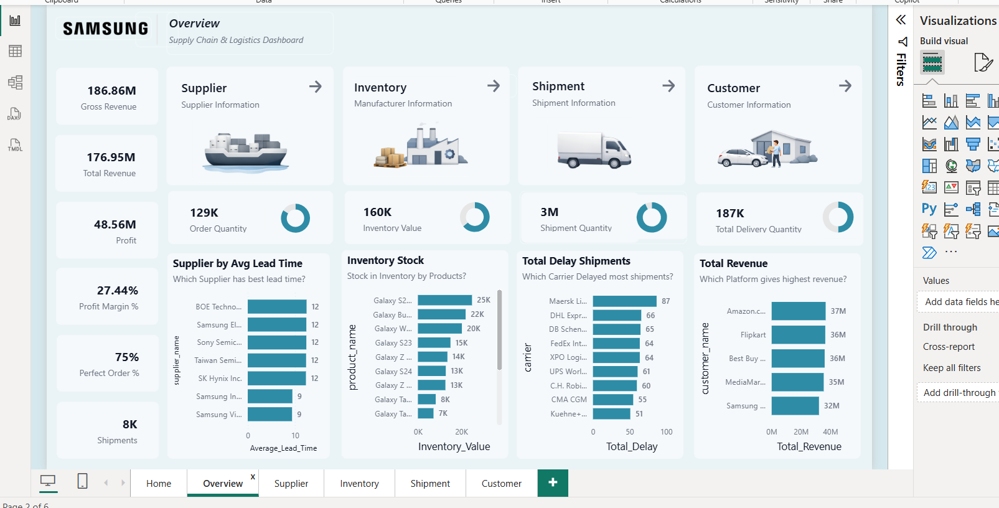
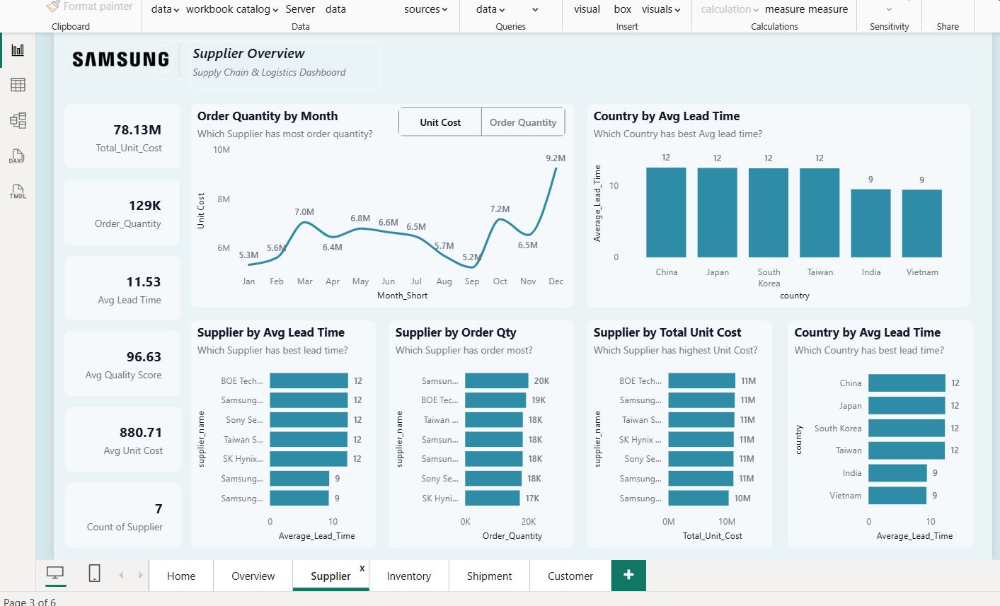
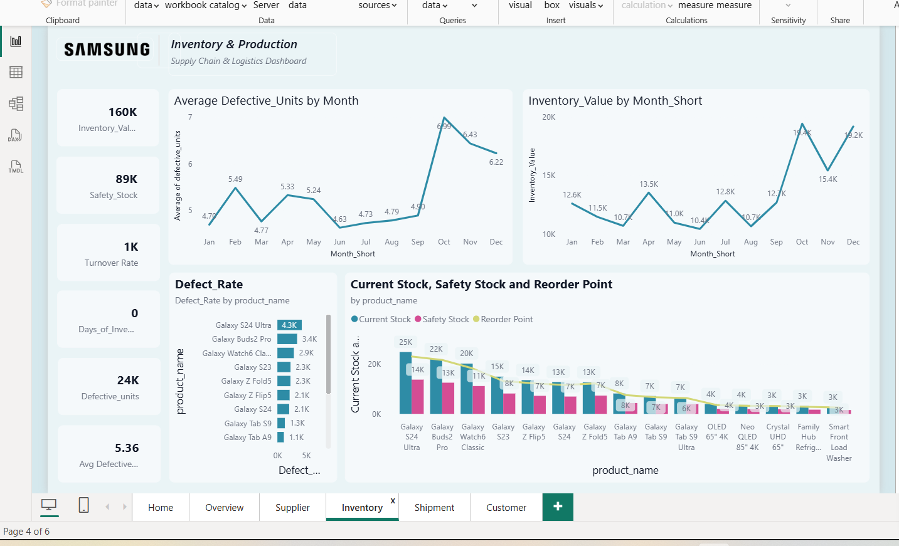
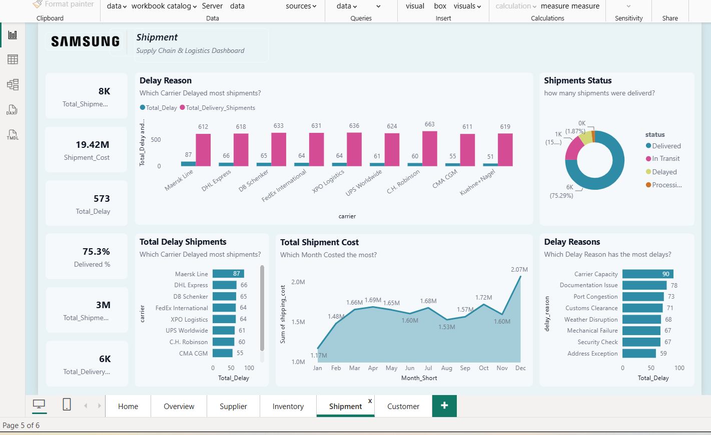
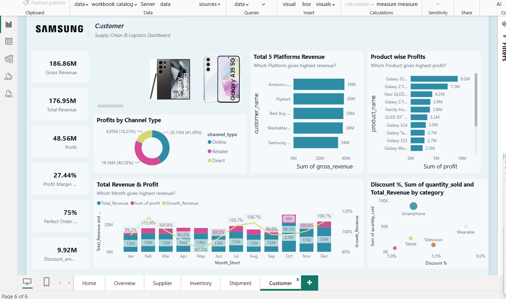

# 📱 Samsung Supply Chain & Logistics Dashboard

A Power BI report analyzing Samsung's supply chain and logistics operations — covering suppliers, inventory, shipments, and customer sales performance.

## 📊 Overview

This dashboard provides an end-to-end view of the supply chain, from supplier procurement through production, shipment, and final sales to customers. It's built to help track efficiency, delays, and profitability across the chain.

**File:** `Samsung_Dashboard.pbix`

## 🗂️ Report Pages

| Page | Description |
|------|-------------|
| **Home** | Landing page with navigation to all report sections |
| **Overview** | High-level KPIs across supplier lead time, inventory stock, shipment delays, and total revenue |
| **Supplier** | Supplier performance — lead time, order quantity, unit cost, and country-wise comparison |
| **Inventory** | Production and inventory health — defect rate, defective units trend |
| **Shipment** | Shipment tracking — delays, delay reasons, shipment cost, and delivery status |
| **Customer** | Sales and profitability — revenue/profit by channel, platform, and product |

## 🖼️ Screenshots

**Home**

**Overview**

**Supplier**

**Inventory**

**Shipment**

**Customer**

> 📁 Add your exported screenshots to a `screenshots/` folder in the repo root using the filenames above (or update the paths here to match your own).

## 🧩 Data Model

The report is built on a star-schema style model with the following tables:

**Fact Tables**
- `fact_sales` – order quantity, gross revenue, profit, discount amount
- `fact_procurement` – unit cost, quality score
- `fact_production` – defective units
- `fact_shipment` – shipping cost, carrier, delay reason, status

**Dimension Tables**
- `dim_supplier` – supplier name, country
- `dim_customer` – customer name, channel type
- `dim_product` – product name, category, image
- `dim_date` – calendar/month reference

**Measure Table**
- `MeasureTable` – all DAX measures (see below)

## 📐 Key Measures

- Total Revenue, Profit, Profit Margin %
- Growth Revenue
- Order Quantity, Total Shipments, Total Delay, Total QTY Delay
- Average Lead Time, Perfect Order %, Delivered %
- Days of Inventory, Inventory Value, Safety Stock, Reorder Point, Turnover Rate
- Defect Rate
- Shipment Cost
- Discount %

## 🛠️ Tools Used

- **Power BI Desktop** for report authoring and DAX measures
- Custom theme and branded visuals (Samsung logo/imagery)

## 🚀 How to Use

1. Clone this repo
2. Open `Samsung_Dashboard.pbix` in [Power BI Desktop](https://powerbi.microsoft.com/desktop/)
3. Refresh the data model if connected to a live source (or explore with the embedded data)
4. Navigate the report using the page tabs / in-report navigation buttons on the Overview page

## 📌 Notes

- This is a personal/portfolio project for practicing Power BI dashboard design and DAX.
- Data used is illustrative and not representative of Samsung's actual internal operations.

---

⭐ Feel free to explore, fork, or reach out with feedback!
