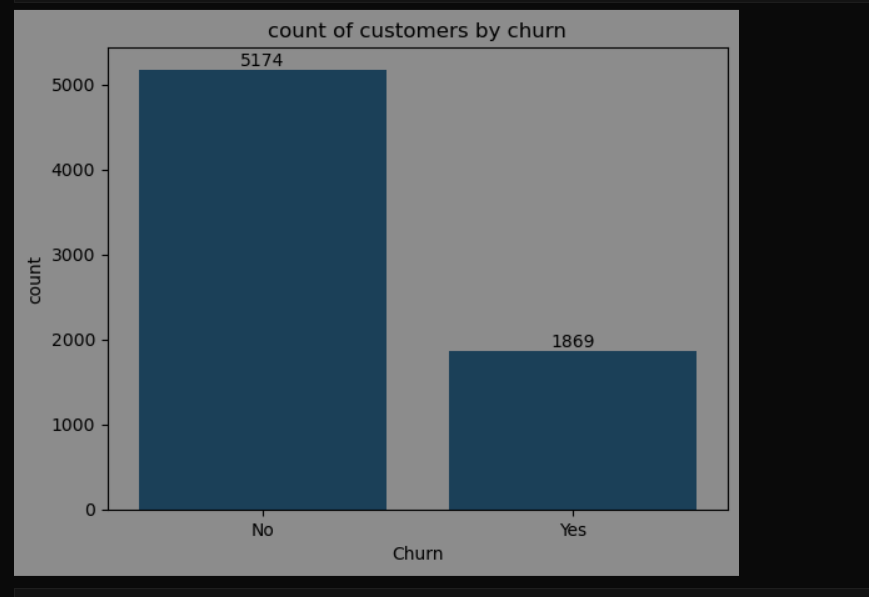
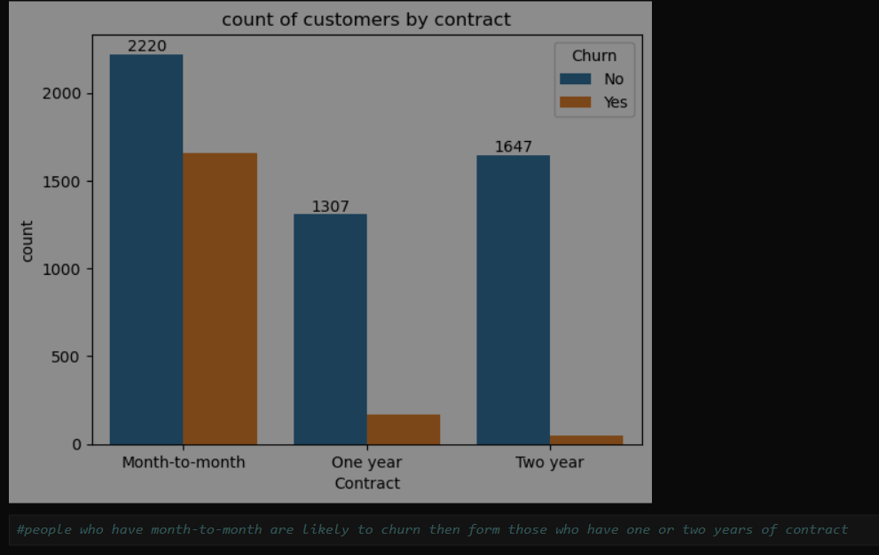
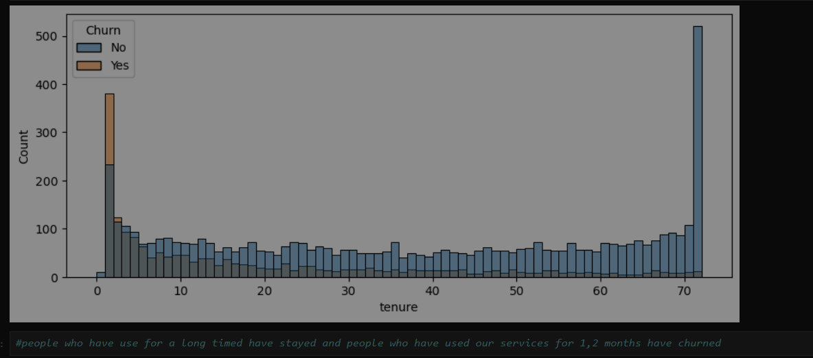
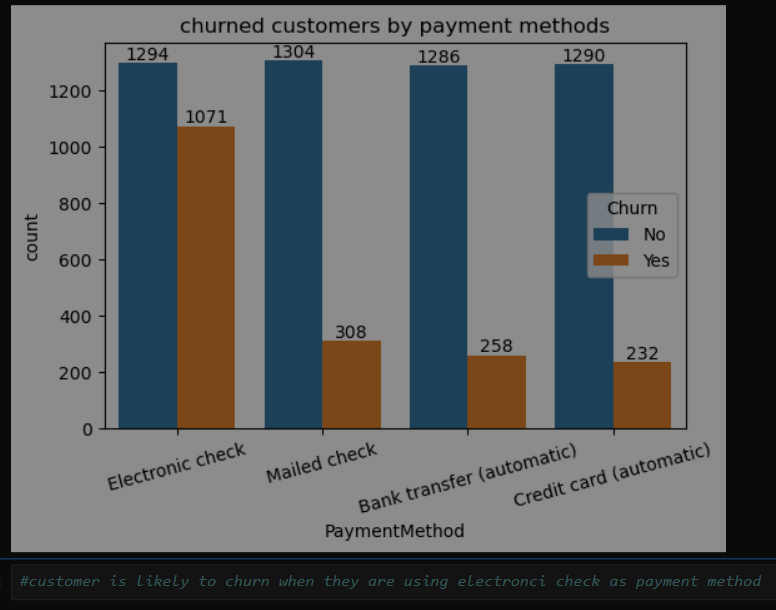

# 📊 Telecom Customer Churn Analysis

## 📌 Project Overview

Customer churn is one of the major challenges faced by telecom companies. Losing customers directly impacts revenue and increases the cost of acquiring new customers.

This project performs an **Exploratory Data Analysis (EDA)** on telecom customer data to identify the key factors associated with customer churn.

The analysis focuses on customer demographics, tenure, services, contract types, payment methods, and billing information to understand which customer segments are more likely to leave.

---

## 🎯 Objectives

The main objectives of this project are:

- Analyze the overall customer churn rate
- Understand customer demographics and their relationship with churn
- Identify high-risk customer segments
- Analyze the impact of contract type on churn
- Analyze the relationship between customer tenure and churn
- Understand the impact of payment methods on churn
- Analyze customer service and subscription patterns
- Generate business insights that can support customer retention strategies

---

## 📊 Key Visualizations

### Overall Customer Churn



### Churn by Contract Type



### Churn by Customer Tenure



### Churn by Payment Method



---

## 📂 Dataset

The dataset contains **7,043 customers** and **21 attributes**.

### Main Features

| Feature | Description |
|---|---|
| `customerID` | Unique customer identifier |
| `gender` | Customer gender |
| `SeniorCitizen` | Whether the customer is a senior citizen |
| `Partner` | Whether the customer has a partner |
| `Dependents` | Whether the customer has dependents |
| `tenure` | Number of months the customer has stayed |
| `PhoneService` | Whether phone service is subscribed |
| `MultipleLines` | Multiple phone lines subscription |
| `InternetService` | Type of internet service |
| `OnlineSecurity` | Online security subscription |
| `OnlineBackup` | Online backup subscription |
| `DeviceProtection` | Device protection subscription |
| `TechSupport` | Technical support subscription |
| `StreamingTV` | Streaming TV subscription |
| `StreamingMovies` | Streaming movies subscription |
| `Contract` | Customer contract type |
| `PaperlessBilling` | Paperless billing status |
| `PaymentMethod` | Customer payment method |
| `MonthlyCharges` | Monthly customer charges |
| `TotalCharges` | Total customer charges |
| `Churn` | Whether the customer left the company |

---

## 🛠️ Tools & Technologies

- **Python**
- **Pandas** – Data manipulation and analysis
- **NumPy** – Numerical operations
- **Matplotlib** – Data visualization
- **Seaborn** – Statistical visualization
- **Jupyter Notebook**

---

## 🔍 Analysis Performed

### 1. Data Understanding

- Examined dataset structure
- Checked column names and data types
- Reviewed numerical and categorical variables
- Checked dataset dimensions
- Investigated missing values
- Checked duplicate customer records

### 2. Data Cleaning

The analysis included:

- Handling data type issues
- Converting `TotalCharges` into a numeric format
- Checking missing values
- Checking duplicate customer IDs
- Preparing the data for exploratory analysis

### 3. Exploratory Data Analysis

The following areas were analyzed:

- Overall churn distribution
- Churn by gender
- Churn by senior-citizen status
- Churn by partner and dependent status
- Churn by tenure
- Churn by internet service
- Churn by contract type
- Churn by payment method
- Churn by monthly charges
- Churn by total charges
- Customer service subscriptions and churn

---

## 📊 Key Insights

### 🔴 Overall Churn

The analysis found an overall customer churn rate of approximately **26.54%**.

This means that more than one-quarter of the customers in the dataset have churned.

---

### 📅 Tenure

Customers with **shorter tenure** show a higher tendency to churn.

Customers in the early stages of their relationship with the company represent an important retention opportunity.

**Business implication:**

> Telecom companies should focus heavily on customer onboarding and engagement during the first few months.

---

### 📄 Contract Type

Customers with **month-to-month contracts** are significantly more likely to churn compared with customers on longer-term contracts.

**Business implication:**

> Offering incentives, discounts, or additional benefits for customers who move to one-year or two-year contracts could help reduce churn.

---

### 💳 Payment Method

Customers using **electronic check** show a higher tendency to churn.

**Business implication:**

> Encouraging customers to use automatic payment methods such as bank transfers or credit cards could be explored as a retention strategy.

---

### 👴 Senior Citizens

Senior-citizen customers show a higher churn tendency compared with non-senior customers.

**Business implication:**

> Targeted support and personalized retention strategies could be considered for this customer segment.

---

### 👥 Gender

The analysis does not indicate gender as one of the major drivers of customer churn.

Therefore, retention strategies should focus more on behavioral and subscription-related factors rather than gender.

---

## 🚨 High-Risk Customer Segment

Based on the analysis, customers with a combination of the following characteristics represent an important churn-risk segment:

```text
Short Tenure
      +
Month-to-Month Contract
      +
Electronic Check Payment